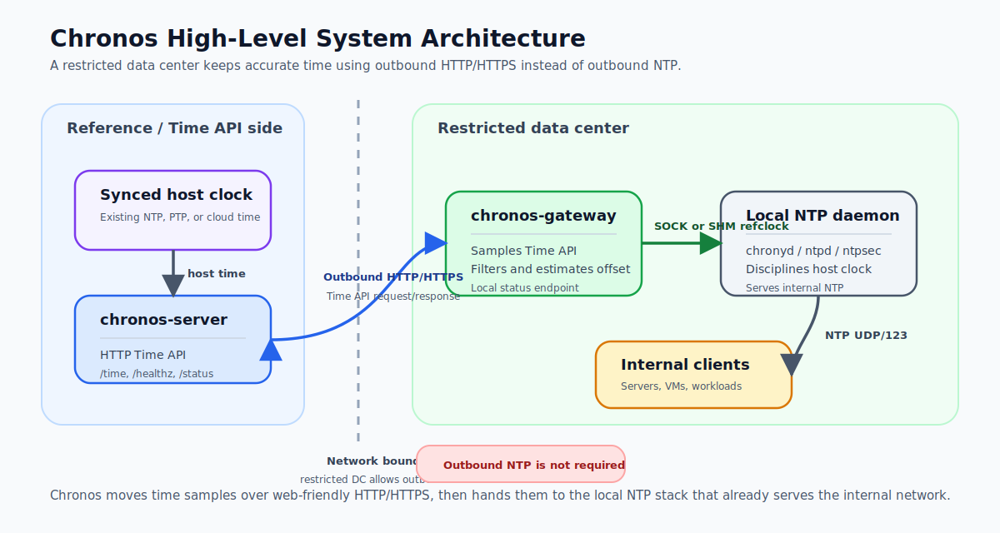

# Chronos

**Chronos is an HTTP-backend time synchronization gateway.** It lets a restricted
data center — one that may only egress over HTTPS — keep accurate time without
outbound NTP. A `chronos-gateway` samples time from a `chronos-server` over
HTTP/HTTPS and feeds the samples to a local `chronyd` via chrony's SOCK
refclock; `chronyd` then disciplines the host clock and serves NTP internally.

## System Architecture



## Components

| Crate | Role |
| --- | --- |
| `chronos-core` | Domain types, ports (traits), and pure logic. No I/O. |
| `chronos-chrony` | `OutputBackend` writing chrony's SOCK refclock over a Unix datagram socket. |
| `chronos-server` | HTTP/HTTPS Time API (`/time`, `/healthz`, `/status`). |
| `chronos-gateway` | Backend client, burst sampler, offset estimator, status API. |
| `chronos-ntp` | Reserved placeholder for v2 output backends. |

## Build

```bash
cargo build --release
cargo test --all
cargo clippy --all-targets --all-features -- -D warnings
```

Binaries are produced at `target/release/chronos-server` and
`target/release/chronos-gateway`. TLS uses rustls with the `ring` backend, which
needs a C compiler to build (but not `cmake`). The container image is built as a
fully static musl binary and shipped on `distroless/static`.

## Run

```bash
chronos-server  --config /etc/chronos/server.yaml
chronos-gateway --config /etc/chronos/gateway.yaml
```

Example configurations live under [`examples/config`](examples/config).

## Quick start (lab)

```bash
# 1. Server (native HTTP), reporting status from chrony on its host.
chronos-server --config examples/config/server.http.yaml

# 2. Gateway sampling that server and writing to the host chrony socket.
#    Prereq: configure chronyd's SOCK refclock. The helper derives the right
#    `poll` from gateway.yaml and installs the drop-in for you:
#        sudo packaging/setup-chrony-refclock.sh \
#            --config examples/config/gateway.yaml --install
#    Run the gateway as root (it writes chrony's root-owned socket).
#    Details: docs/deployment-gateway.md.
sudo chronos-gateway --config examples/config/gateway.yaml

# 3. Inspect.
curl -fsS http://127.0.0.1:8080/time | jq
curl -fsS http://127.0.0.1:9090/status | jq
```

## Docker

A single combined image contains both binaries; consumers pick the binary via
`command`. There is no fixed `ENTRYPOINT` and no baked-in `HEALTHCHECK`
(healthchecks are per service in Compose, using each binary's `healthcheck`
subcommand rather than `curl`, which the distroless image does not ship).

```bash
TS=$(date -u +%Y%m%d%H%M%S)
docker build -t "ghcr.io/maple52046/chronos:1.0.0-${TS}" .
docker push "ghcr.io/maple52046/chronos:1.0.0-${TS}"
```

See [`examples/compose`](examples/compose).

## Kubernetes

Gateway Kubernetes manifests live under [`examples/k8s/gateway`](examples/k8s/gateway).
Shared resources are kept in `base/`; choose one daemon-specific overlay for the
node-local NTP daemon:

```bash
kubectl apply -k examples/k8s/gateway/ntpsec
kubectl apply -k examples/k8s/gateway/ntpd
kubectl apply -k examples/k8s/gateway/chrony
```

Before applying, edit the selected overlay's `configmap.yaml` and set
`data.gateway.yaml -> backends[0].base_url` to the Chronos server URL. See the
gateway example README for daemon prerequisites and verification steps.

## Documentation

- [Architecture](docs/architecture.md)
- [HTTP Time API protocol](docs/protocol.md)
- [chrony integration](docs/chrony-integration.md)
- [Deploying the server](docs/deployment-server.md)
- [Deploying the gateway](docs/deployment-gateway.md)
- [Security](docs/security.md)
- [Troubleshooting](docs/troubleshooting.md)
- [Develop plan](docs/develop-plan.md)

## License

MIT. See [LICENSE](LICENSE).
